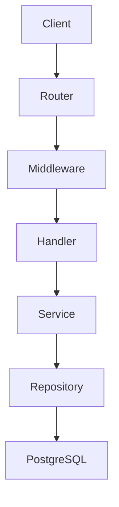
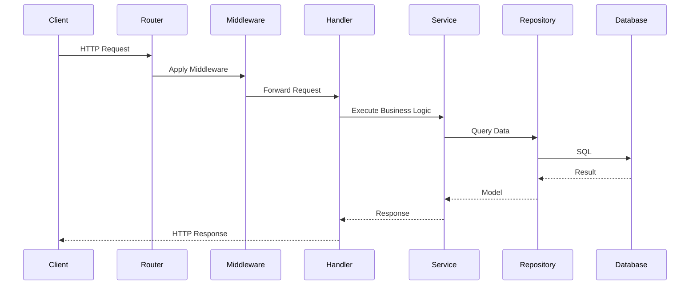
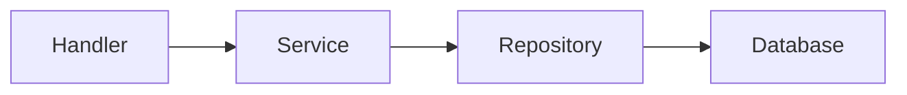

# Expense Tracker API

<p align="center">


</p>

A RESTful Expense Tracker API built with **Go**, **PostgreSQL**, and **Docker**, using a layered architecture and standard backend engineering practices.

---

## Table of Contents

- [Overview](#overview)
- [Features](#features)
- [Architecture](#architecture)
- [Project Structure](#project-structure)
- [Technology Stack](#technology-stack)
- [Getting Started](#getting-started)
- [API Reference](#api-reference)
- [Testing](#testing)
- [Design Decisions](#design-decisions)
- [License](#license)
- [Authors](#authors)

---

# Overview

Expense Tracker is a RESTful API for managing personal expenses. While the business domain is intentionally simple, the project focuses on backend engineering practices commonly used in production Go services.

## Highlights

- RESTful API
- Layered Architecture
- Repository Pattern
- PostgreSQL + pgx
- Goose Migrations
- Docker & Docker Compose
- Graceful Shutdown
- Request Logging & Recovery Middleware
- UUID-based Requests
- Unit & Integration Testing

# Features

The project demonstrates backend engineering practices beyond basic CRUD operations.

| Category | Features |
|----------|----------|
| API | Create, Read, Update, and Delete expenses |
| Architecture | Layered Architecture, Repository Pattern, Dependency Injection |
| Database | PostgreSQL, pgx, Goose Migrations |
| Middleware | Logging, Recovery, Request ID |
| Reliability | Graceful Shutdown, Context Propagation |
| Development | Docker, Docker Compose, Environment-based Configuration |
| Testing | Unit & Integration Tests |
| Observability | Request ID Middleware for request tracing |

# Architecture

The project follows a layered architecture that separates responsibilities into independent components. Each layer communicates only with the layer directly below it, resulting in a modular, maintainable, and testable codebase.

## High-Level Architecture



## Request Flow



## Layer Responsibilities

| Layer | Responsibility |
|--------|----------------|
| Router | Registers API routes |
| Middleware | Handles logging, recovery, and request IDs |
| Handler | Processes HTTP requests and responses |
| Service | Implements business logic |
| Repository | Performs database operations |
| PostgreSQL | Persists application data |

## Dependency Flow


Each layer depends only on the layer directly to its right, keeping the application loosely coupled and easy to test.

# Project Structure

```text
expense-tracker
├── cmd/
│   └── api/
├── internal/
│   ├── config/
│   ├── database/
│   ├── handler/
│   ├── middleware/
│   ├── model/
│   ├── repository/
│   ├── router/
│   └── service/
├── migrations/
├── scripts/
├── Dockerfile
├── docker-compose.yml
├── go.mod
└── README.md
```

## Directory Overview

| Directory | Purpose |
|-----------|---------|
| `cmd/api` | Application entry point |
| `internal/config` | Loads application configuration |
| `internal/database` | Database connection and initialization |
| `internal/handler` | HTTP request handlers |
| `internal/middleware` | Logging, recovery, and request ID middleware |
| `internal/model` | Domain models |
| `internal/repository` | Database access layer |
| `internal/router` | Route registration |
| `internal/service` | Business logic |
| `migrations` | Goose database migrations |
| `scripts` | Development helper scripts |


# Technology Stack

The project is built using a minimal set of technologies to keep the codebase lightweight, maintainable, and production-oriented.

| Technology | Purpose |
|------------|---------|
| **Go** | Backend programming language |
| **net/http** | HTTP server and routing |
| **PostgreSQL** | Relational database |
| **pgx** | PostgreSQL driver |
| **Goose** | Database schema migrations |
| **Docker** | Containerization |
| **Docker Compose** | Local development environment |
| **Request ID (UUID)** | Generates unique request identifiers for logging and request tracing. |

## Design Principles

The implementation follows a few core engineering principles:

- **Simplicity** – Prefer simple, explicit solutions over unnecessary abstractions.
- **Separation of Concerns** – Keep HTTP, business logic, and data access isolated.
- **Dependency Injection** – Improve modularity and testability.
- **Testability** – Design components to be tested independently.
- **Production-Oriented Development** – Use tools and patterns commonly found in real-world Go services.

# Getting Started

## Prerequisites

Make sure the following tools are installed:

| Tool | Version |
|------|---------|
| Go | 1.24+ |
| PostgreSQL | 17+ |
| Docker | Latest |
| Docker Compose | Latest |
| Git | Latest |

## Installation

### 1. Clone the repository

```bash
git clone https://github.com/MrSafaran/expense-tracker.git
cd expense-tracker
```

### 2. Install dependencies

```bash
go mod tidy
```

### 3. Configure environment variables

Create a `.env` file in the project root.

```env
PORT=9090

DB_HOST=localhost
DB_PORT=5432
DB_USER=postgres
DB_PASSWORD=postgres
DB_NAME=expense_tracker
```

### 4. Create the database

```sql
CREATE DATABASE expense_tracker;
```

### 5. Apply migrations

```bash
goose up
```

### 6. Run the application

```bash
go run ./cmd/api
```

The API will be available at:

```text
http://localhost:9090
```

### 7. Verify the server

```bash
curl http://localhost:9090/health
```

Expected response:

```json
{
  "status": "ok"
}
```

---

## Running with Docker

```bash
docker compose up --build
```

Stop the containers:

```bash
docker compose down
```

---

## Useful Commands

| Command | Description |
|---------|-------------|
| `go run ./cmd/api` | Run the API |
| `go test ./...` | Run all tests |
| `go fmt ./...` | Format source code |
| `go vet ./...` | Static analysis |
| `goose up` | Apply migrations |
| `docker compose up --build` | Start all services |

# API Reference

## Endpoints

| Method | Endpoint | Description |
|--------|----------|-------------|
| `GET` | `/` | Home endpoint |
| `GET` | `/health` | Health check |
| `GET` | `/expenses` | Retrieve all expenses |
| `GET` | `/expenses/{id}` | Retrieve a single expense |
| `POST` | `/expenses` | Create a new expense |
| `PUT` | `/expenses/{id}` | Update an existing expense |
| `DELETE` | `/expenses/{id}` | Delete an expense |

## Example Request

```bash
curl -X GET http://localhost:9090/expenses
```

## Example Response

```json
[
  {
    "id": 2,
    "title": "Coffee",
    "amount": 4,
    "category": "Food"
  }
]
```

## Response Codes

| Status Code | Description |
|------------|-------------|
| `200 OK` | Request completed successfully |
| `201 Created` | Resource created successfully |
| `400 Bad Request` | Invalid request payload |
| `404 Not Found` | Resource not found |
| `500 Internal Server Error` | Unexpected server error |

# Testing

The project includes both unit and integration tests to verify the correctness of business logic and database interactions.

Run all tests with:

```bash
go test ./...
```

## Test Coverage

- Unit tests for business logic
- Handler tests for HTTP endpoints
- Integration tests for repository and database operations

# Design Decisions

The project follows a set of design decisions that prioritize maintainability, modularity, and production-oriented development.

| Decision | Reason |
|----------|--------|
| **Layered Architecture** | Separates concerns and keeps the codebase modular. |
| **Repository Pattern** | Isolates data access from business logic. |
| **Dependency Injection** | Reduces coupling and improves testability. |
| **Go Standard Library (`net/http`)** | Keeps the project lightweight with minimal dependencies. |
| **PostgreSQL + pgx** | Reliable relational database with a high-performance Go driver. |
| **Goose Migrations** | Enables version-controlled and repeatable schema changes. |
| **Docker** | Provides a consistent development environment. |
| **Middleware** | Centralizes cross-cutting concerns such as logging, recovery, and request tracing. |
| **Environment Variables** | Keeps configuration separate from application code. |

These decisions make the project easier to maintain, test, and extend while following common backend development practices.


# License

This project is licensed under the MIT License.  

# Authors 

- **Mohammadreza Safaran** – [GitHub](https://github.com/MrSafaran)